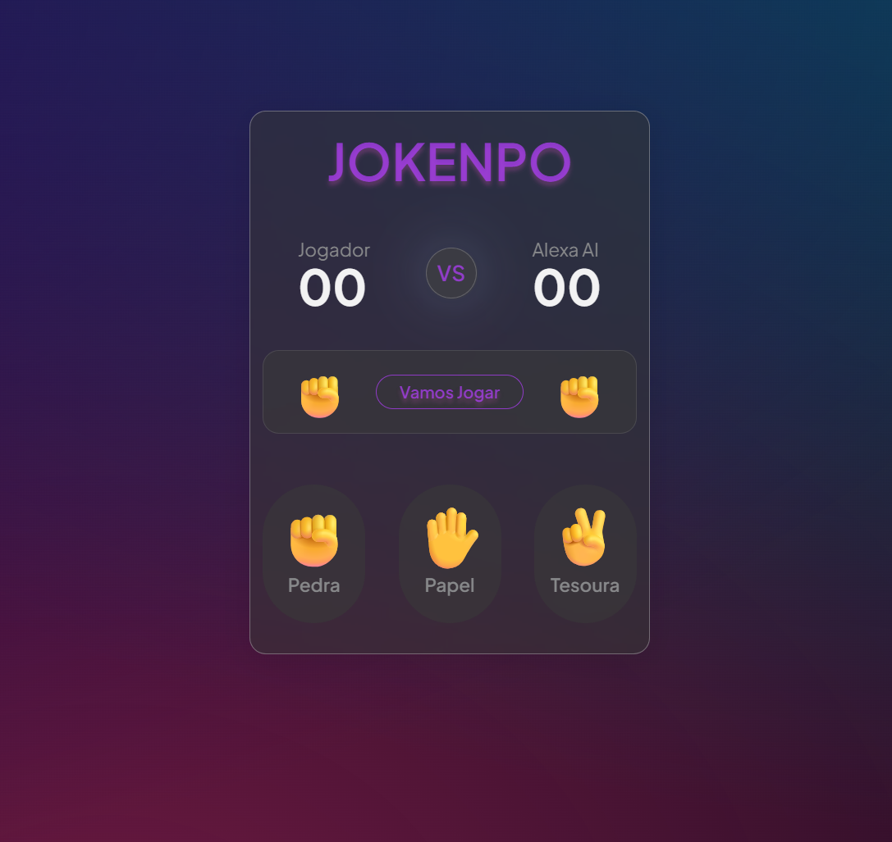
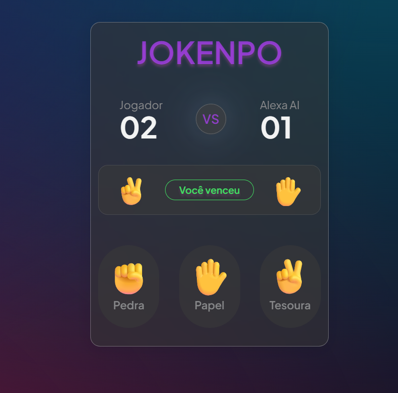

# Jokenpo 🎮

<p>
  
  
</p>

Jogo de Pedra, Papel e Tesoura contra a **Alexa AI**, desenvolvido com HTML, CSS e JavaScript puro. O jogador escolhe uma das três opções e enfrenta a Alexa, que faz sua escolha de forma aleatória. O resultado aparece após uma animação de 1.5 segundos, e o placar é atualizado automaticamente a cada rodada.

## Regras

| Jogada | Ganha de | Perde para |
|--------|----------|------------|
| ✊ Pedra | ✌️ Tesoura | ✋ Papel |
| ✋ Papel | ✊ Pedra | ✌️ Tesoura |
| ✌️ Tesoura | ✋ Papel | ✊ Pedra |

## Funcionalidades

- Escolha aleatória da Alexa AI a cada rodada
- Animação de suspense de 1.5s antes de revelar o resultado
- Placar persistente durante a sessão para jogador e Alexa
- Feedback visual colorido: 🟢 vitória, 🔴 derrota, 🟣 empate

## Estrutura do Projeto

```
jokenpo/
├── index.html       # Estrutura da página
├── style.css        # Estilização
├── script.js        # Lógica do jogo
└── REGRAS_JOGO.md   # Regras e combinações detalhadas
```

## Tecnologias

- HTML5
- CSS3
- JavaScript (Vanilla)

## Como Jogar

1. Clone o repositório:
   ```bash
   git clone https://github.com/seu-usuario/jokenpo.git
   ```
2. Abra o arquivo `index.html` no navegador
3. Clique em **Pedra** ✊, **Papel** ✋ ou **Tesoura** ✌️
4. Aguarde 01 segundo para ver o resultado
5. O placar é atualizado automaticamente a cada rodada
